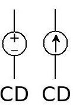
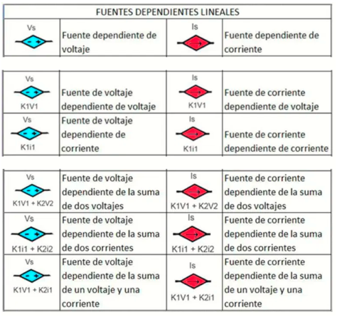
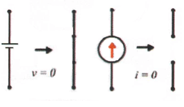
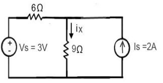
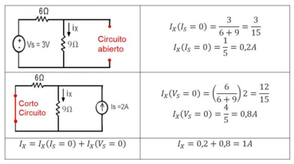
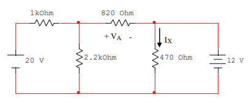
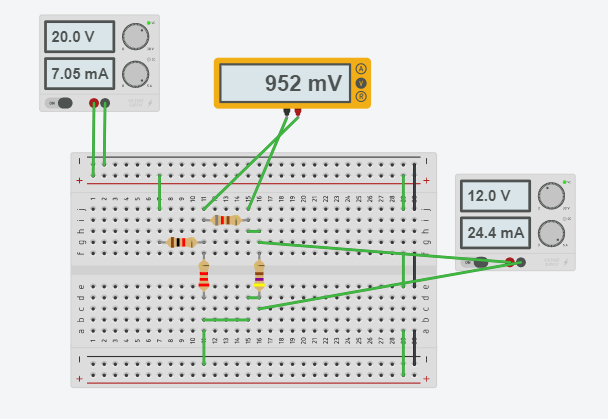
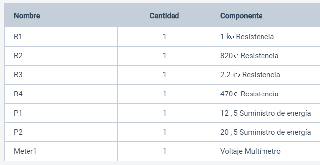

# Informe-4
#  Teorema de Superposición.

## OBJETIVOS

Comprobar experimentalmente el Teorema de Superposición.

**Objetivos específicos:**  
 - Demostrar si se cumple el Teorema de Superposición.    
 - Comprobar los resultados y los datos necesarios  del  circuito    
   propuesto, demostrando el Teorema de Superposición.    
 - Comparar los resultados obtenidos tanto del  análisis teórico como
   simulado y sacar conclusiones.       
       
## MARCO TEÓRICO

La Respuesta de un circuito lineal que tenga más de una fuente independiente es igual a cada una de las fuentes por separado” (giovannihr2005, 2014).  Es el concepto dado para lo que es el teorema de superposición, una forma mas fácil de entender es que el efecto total de algo que queremos calcular es igual a la suma de los efectos parcial de cada una de las fuentes que posee sin embargo, hay un información previa.
 
## Fuentes

**Fuentes independientes**
Como el nombre lo indica, no dependen de algún valor para poder ejecutarse, existen 2 tipos de fuentes, las de voltaje y de corriente, también se clasifican dependiendo de la corriente, ya se alterna o continua.

<section>
      

                   
   

   </section>
   
 *Ilustración 1, fuentes de voltaje y corriente*
   
 
 **Fuentes dependientes**
Al contrario de las independientes, estas necesitan un valor extra para poder saber si valor.

<section>
      

                   
   

   </section>
   
  *Ilustración 2, Tipos de fuentes dependientes*
 
 
Con todo esto podemos entender el principio que se utiliza en el teorema de superposición.
La base este es tomar las fuentes independientes de voltaje como cortocircuitos y las fuentes independientes de corriente como circuitos abiertos, des esta forma calculamos el valor requerido en cada uno de los casos y el resultado final de cada uno es sumado para encontrar el resultado total.

<section>
      

                   
   

   </section>
   
   *Ilustración 3, equivalencia de fuentes.*
 

 Un buen ejemplo que hay es un circuito con los 2 tipos de fuente.
 
 <section>
      

                   
   

   </section>
   
   *Ilustración 4, circuito potencial para teorema de superposición.*
   
   
   
   En donde se harán 2 subcircuitos desactivando una fuente a la vez y calculando el valor de la incógnita en cada caso.
   
   <section>
      

                   
   

   </section>
   
   *Ilustración 5.*
  
 
 
# **DESCRIPCIÓN DE LOS EQUIPOS Y MATERIALES**

**Fuente de voltaje C.D.** Es de donde conseguir electricidad para el circuito
<section>
      

                   
   

   </section> 

   
**Multímetro digital**. Nos ayudara para poder hacer las mediciones de la practica

</section>
      

                   
   

   </section>

**Resistores** de 1kΩ, 2.2kΩ, 470Ω y 820Ω. Los utilizaremos para crear el circuito que vamos a medir

</section>
      

                   
   

   </section>

**Protoboard.** Es la base en la cual se va a formar el circuito con los elementos de este.
</section>
      

                   
   

   </section>
   

# **PROCEDIMIENTO**

Arme el circuito que se muestra en la figura 3.1.
</section>
      

                   
   

   </section>

Con las dos fuentes conectadas, mida el voltaje VA y la corriente IX, respetando
tanto la polaridad del voltaje como el sentido de la corriente que se proporcionan. 
Anote el valor de las mediciones en la tabla 1 y 2 respectivamente.

Haga “cero” la fuente de voltaje de 12 V (V2) y mida el voltaje VA y la corriente
IX, respetando tanto la polaridad del voltaje como el sentido de la corriente que se
proporcionan. Anote el valor de las mediciones en la tabla 1 y 2 respectivamente.

Haga “cero” la fuente de voltaje de 20 V (V1) y mida el voltaje VA y la corriente
IX, respetando tanto la polaridad del voltaje como el sentido de la corriente que se
proporcionan. Anote el valor de las mediciones en la tabla 1 y 2 respectivamente.

***Tabla 3.1. Resultados obtenidos para el circuito de la figura 3.1.***
| V total[V] |va si v2=0| va si v1=0|
|------------|-----------------|---------------------|
|   -0.95    |6.53             | -7.48               |

***Tabla 3.2. Resultados obtenidos para el circuito de la figura 3.1.***
|  I total [mA]  |Ix si v2=0| Ix si v1=0|
|------------|-----------------|---------------------|
|-25.5       |-25.5            |0|

## **DIAGRAMAS**
</section>
      

                   
   

   </section>
   
## **MAPA DE VARIABLES**

   **Resistores**: de 1kΩ, 2.2kΩ, 470Ω y 820Ω. 
   
   **Fuentes**: de 12[V] y 20[V].
    
## **DESCRIPCIÓN**
Crear una cuenta de Tinkercad y generar la simulación de la practica 3

## **LISTA DE COMPONENTES**

 </section>
      

                   
   

   </section>
   

## **CONCLUSIONES**

El teorema de superposición permite evaluar un circuito al separarlo en varios componentes, para luego sumar los datos y hallar los valores correspondientes, en el que, el resultado no cambiará y tendrá un porcentaje de error muy pequeño, puesto que, la mayoría de los valores obtenidos en el cálculo de los ejercicios propuestos fueron satisfactorios.

Al emplear el teorema de superposición, se comprueba una vez más, que es una forma más eficiente que al resolver los circuitos de manera práctica, sin embargo, hay que tener en cuenta que su aplicación se limita a circuitos con componentes lineales.

## **RECOMENDACIONES**

Para mejorar un poco la forma de realizar los laboratorios, ayudaria el poder implementar un tiempo de desarrollo de las guias durante la hora de clase.

Para un comprension  total de todo lo impartido en fundamentos de circuitos electricos, las clases teoricas y los laboratorios podrian ir mas de la mano con los temas para que no existan confunciones a la hora de realizar cualquier tipo de actividad.

## **CRONOGRAMA**

 </section>
      

                   
   

   </section> 

  

# **BIBLIOGRÁFICA**

William H. Hayt, J., Kemmerly, J. E., & Durbin, S. M. (2012). Análisis de circuitos en ingenieria. Buffalo: Mc Graw Hill.
#12—Teorema de superposición. (2016, mayo 30). https://www.youtube.com/watch?v=yGxCn_U6uOg&feature=youtu.be&list=PLkzvG4knsNz9x_xIDl5WlHwcHDibWHanF

giovannihr2005. (2014, agosto 28). Capítulo 22: Linealidad y Superposición. Análisis de Circuitos En Ingeniería. https://analisisdecircuitos1.wordpress.com/2014/08/27/capitulo-22-linealidad-y-superposicion/

## **ANEXOS**
https://github.com/attoala/Informe-4/tree/master/Anexos
